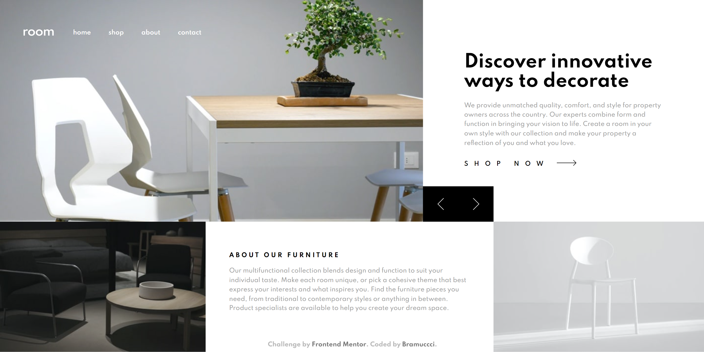

# Frontend Mentor - Room homepage solution

This is a solution to the [Room homepage challenge on Frontend Mentor](https://www.frontendmentor.io/challenges/room-homepage-BtdBY_ENq). Frontend Mentor challenges help you improve your coding skills by building realistic projects.

## Table of contents

-   [Overview](#overview)
    -   [The challenge](#the-challenge)
    -   [Screenshot](#screenshot)
    -   [Links](#links)
-   [My process](#my-process)
    -   [Built with](#built-with)
    -   [What I learned](#what-i-learned)
    -   [Continued development](#continued-development)
    -   [Useful resources](#useful-resources)
-   [Author](#author)

## Overview

### The challenge

Users should be able to:

-   View the optimal layout for the site depending on their device's screen size
-   See hover states for all interactive elements on the page
-   Navigate the slider using either their mouse/trackpad or keyboard

### Screenshot

### Links

-   Solution URL: [GitHub](https://github.com/bramuccci/room-homepage)
-   Live Site URL: [Netlify](https://bramuccci-room-homepage.netlify.app/)

## My process

### Built with

-   Semantic HTML5 markup
-   Sass
-   JavaScript

### What I learned

I learned the use of **data-** for styling and for coding. I have to investigate more, but I can say that finally understand its purpose.

This was really useful with the _navigation_ and the _carousel_. Pretty happy with the former. The latter was a little tricky, at the end I decided use the image as a background.

The _vendor_ directory in Sass was a new incorporation. Only a detail.

I create a JSON with the data because of the problems when I used a template.

### Continued development

My carousel and my code aren't the best. I feel everything forced and not very extensible.

I hate that the height of the header changes in a 1024px viewport. And also that the buttons aren't aligned with the section below. I saw these problems to late and now I don't now how to fixed without breaking everything (I will be glad of hearing suggestions).

The HTML structure and how to do it correctly is one of my biggest focuses right now.

### Useful resources

-   [Animated Hamburger Menu Tutorial](https://www.youtube.com/watch?v=dIyVTjJAkLw) - This tutorial is the reason of my menu animated button. I liked a lot the result, so watch this video tutorial!
-   [Responsive nav tutorial](https://www.youtube.com/watch?v=HbBMp6yUXO0&t=2645s) - Kevin Powell is a big inspiration. I did navs in the past, but they never were so complete like this one. Cannot wait for taking the Scrimba course.

## Author

-   Frontend Mentor - [@bramuccci](https://www.frontendmentor.io/profile/bramuccci)
-   Twitter - [@bramuccci](https://www.twitter.com/bramuccci)
